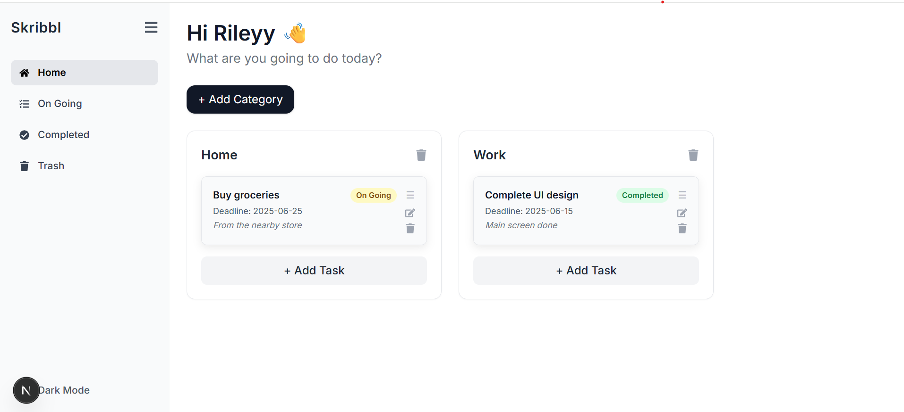
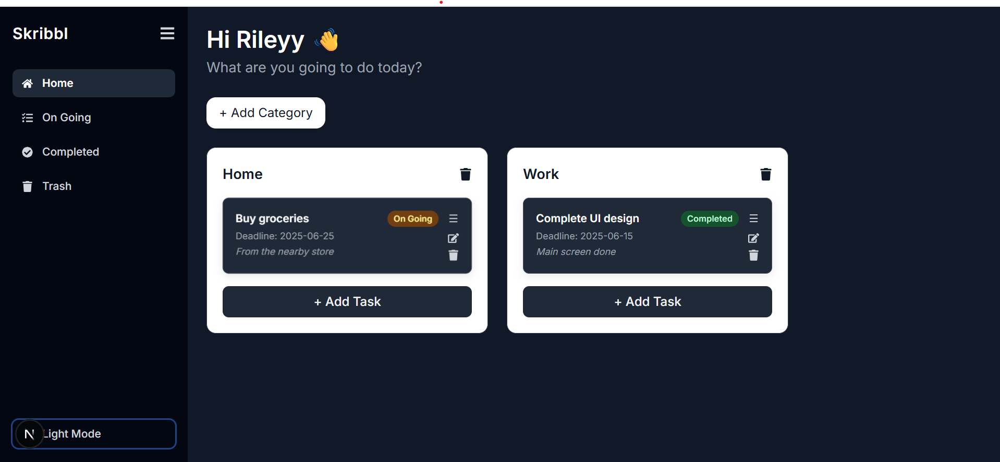
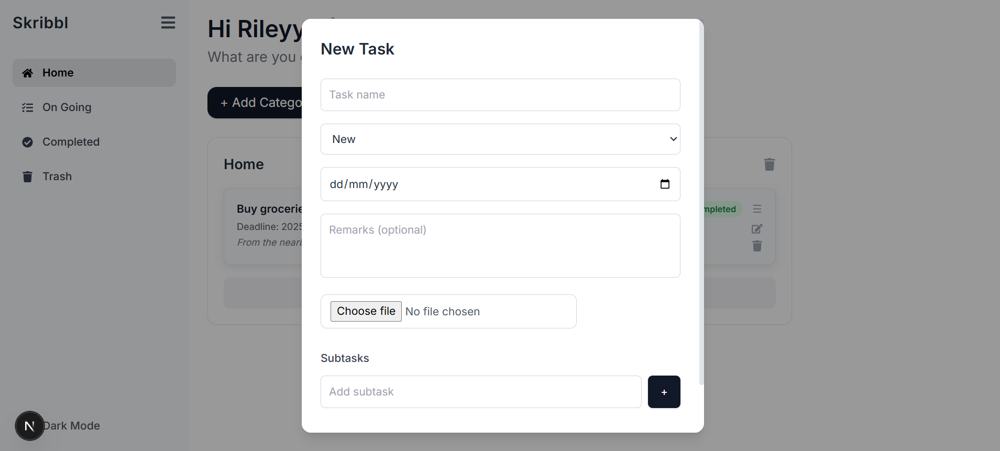

# ✨ Skribbl - Notion-Style Todo App

Skribbl is a sleek, Gen-Z-inspired Notion-style todo app built with **Next.js**, designed for fast, intuitive task management. It supports categorized todo boards, subtask checklists, drag-and-drop interactions. You can easily manage your tasks in a modern UI — think Trello + Notion vibes!

---

## 🎯 Features

- ✅ Create, edit, and delete tasks with ease
- ✅ Support for subtasks with checkbox state sync
- ✅ Drag and drop tasks and subtasks (DnD Kit)
- ✅ Category-based task grouping (e.g., `New`, `Ongoing`, `Completed`)
- ✅ Beautiful modal for editing tasks
- ✅ Upload files per task
- ✅ Add remarks and tags to each task
- ✅ Persistent state saved to localStorage
- ✅ Dark mode toggle with collapsible sidebar
- ✅ Responsive and Gen-Z-friendly UI

---

## 📸 Screenshots

### 🧱 Board View



### 🗂️ Task Modal with Subtasks & Upload


---

## 🛠️ Tech Stack

- **Frontend**: [Next.js](https://nextjs.org/), [TypeScript](https://www.typescriptlang.org/)
- **Drag & Drop**: [@dnd-kit](https://dndkit.com/)
- **Styling**: SCSS / Tailwind CSS
- **State**: `useState` + `localStorage` persistence
- **File Upload**: Stored in-memory or linked via preview

---

## 🚀 Getting Started

```bash
git clone https://github.com/rellisapk/Skribbl-Notion-clone-with-next.js-.git
cd Skribbl-Notion-clone-with-next.js-
npm install
npm run dev
